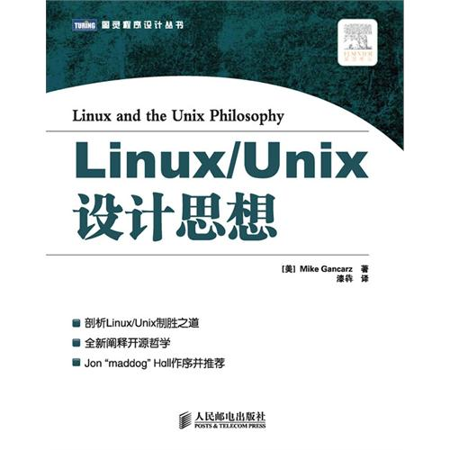
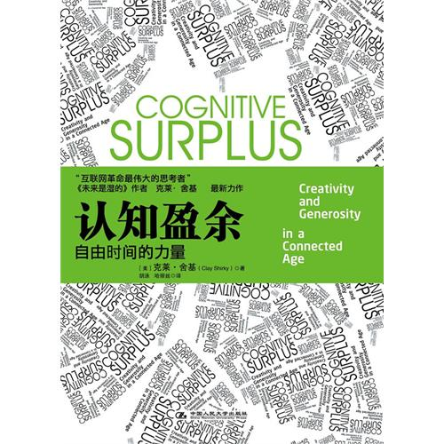
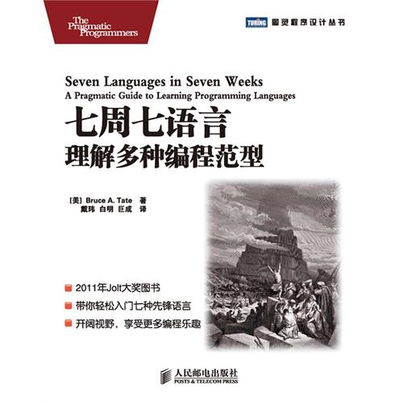

-- filename: 2013-08-07-readings-review-yearly.md

## 每年度阅读回顾

在网络上一个空间中，看到了Amazon的CTO，Werner Vogels在他的[博客][1]中，列出了2012年读过的书籍和文章，这是一个Back to Basics的系列。

其他一些别人推荐或读过的书籍有：

- <Linux/Unix设计思想> by Mike Gancarz

(本书适合入门，初步体会Linux/Unix的设计)

- <认知盈余> by 克莱·舍基

- <七周七语言 理解多种编程范式> by Bruce A. Tate

--

[1] http://www.allthingsdistributed.com/2012/12/paper-readings-2012.html "The Back-to-Basics Readings of 2012"