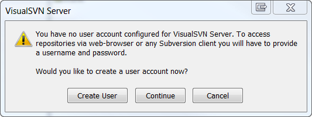
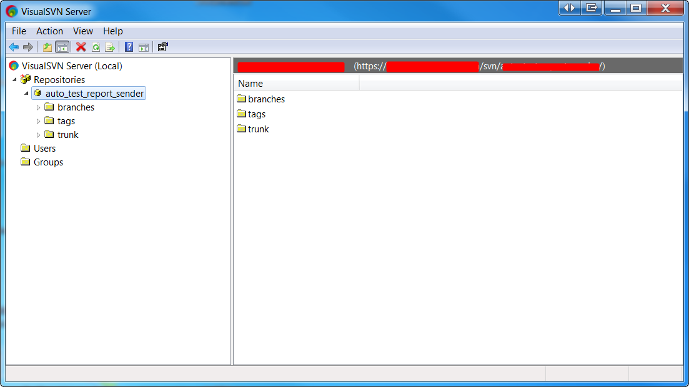

## 使用VisualSVN建立SVN Server

安装windows版
-------------

1. 运行exe后，设定作为server端存储使用的目录是F:\localSVNServer.

2. 启动VisualSVN Server Manager；

3. create new repository - rep001, 则其访问目录就是https://YOUR_IP_ADDRESS/svn/rep001/;

4. 首先需要创建用户，否则会有警告信息：

创建user：admin@admin

5. 检出https://YOUR_IP_ADDRESS/svn/rep001/branches目录。

6. 在没有将VisualSVN Server注册为windows service之前，在需要checkin/checkout时，需要手动启动VisualSVN Server Manager。

7- 在不经配置的情况下，提交代码时不会强制输入comment。